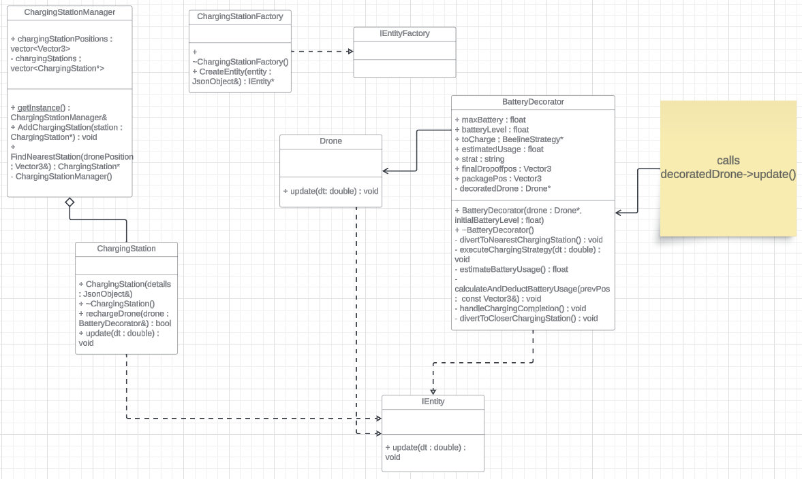
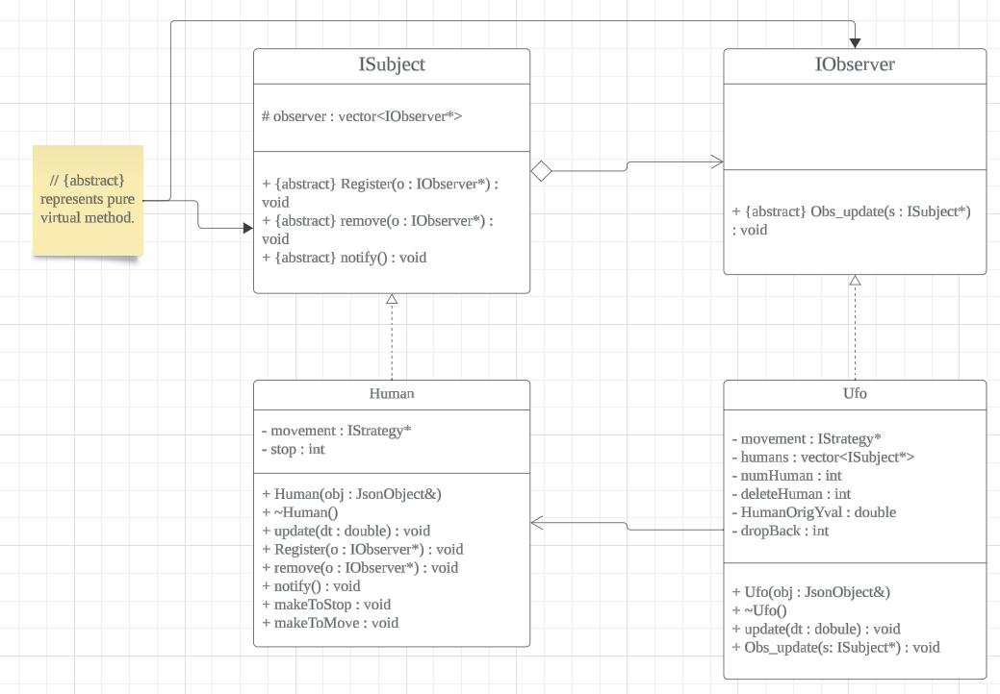
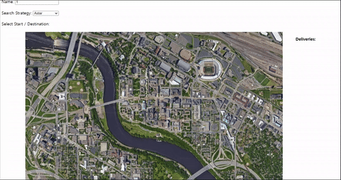

# Drone_Simulation
## Team Members: Jun Yeol Ryoo(ryoo0005), Jiseok Moon(moon0222), Guy Fleischhacker(fleis215)

## Overview:
This project introduced new features into a drone simulation using various design patterns. Throughout the semester, we implemented several design patterns into an existing codebase, including:
  1. **Factory Design Pattern**: For the creation of Entities in the simulation.
  2. **Decorator Pattern**: For modifying how drones move.
  3. **Strategy Pattern**: For route-finding algorithms.
  4. **Observer Pattern**: Implemented to establish a dynamic interaction between human and the UFO entities.
  5. **Singleton Pattern**: For managing charging stations and battery entities.

UML class diagram for Decorator design pattern:


UML class diagram for Observer design pattern:


## How to run the simulation
```
# Navigate to the project directory 
cd /path/to/repo/project 

# Build the project
make -j
 
# Run the project (./build/web-app <port> <web folder>) 
./build/bin/transit_service 8081 apps/transit_service/web/
```
Navigate to http://127.0.0.1:8081 in a web browser to see the simulation. Use http://127.0.0.1:8081/schedule.html to schedule deliveries.

## Simulation Components
**Simulation Model**:
The core of the backend, managing the simulation, entities, and their interactions. It handles creation via JSON objects and communicates with web services for real-time updates.

**User Interface (UI)**:
Provides a simple UI for users to interact with the simulation, including focusing on specific objects, adjusting simulation speed, and scheduling deliveries.

**Entities**:
Entities are created using factories and adhere to the **IEntity** interface. They perform various tasks based on their properties and the update function.

**Drone and Strategies**:
Drones deliver packages using different routing algorithms (A* search, DFS, BFS, Dijkstra) and adjust routes based on real-time data.

**UFO**:
The UFO entity interacts with human entities, attempting to delete them when their count exceeds a threshold, ensuring the simulation runs smoothly without any lag.

**Battery**:
Incorporates realistic battery management for drones, including recharging at strategically placed charging stations when battery levels are low.

**Charging Station**:
Charging stations are placed every 250 units, allowing drones to recharge and continue deliveries efficiently.

## Simulation
Map view<br>


Delivery schedule page<br>


Drone visits charging station during package delivery due to low battery<br>


UFO failed to delete a human entity from the simulation<br>


UFO successfully deleted a human entity from the simulation<br>

